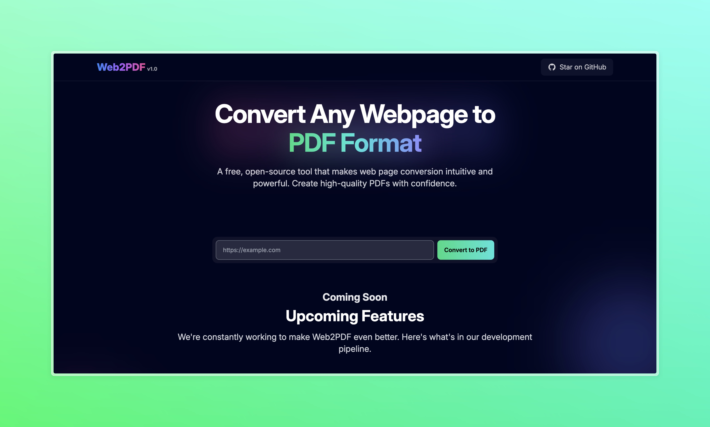

# Web to PDF Converter 🚀



A modern, fast, and user-friendly web application that converts web pages to PDF documents with high fidelity. Built with Vite, React, TypeScript, and FastAPI.

## ✨ Features

- 🌐 Convert any webpage to PDF with a single click
- 🎨 Beautiful, modern UI with glowing effects
- 🚄 Fast and efficient conversion process
- 📱 Responsive design that works on all devices
- 🔒 Secure and reliable PDF generation
- ⚡ Built with performance in mind

## 🛠️ Tech Stack

### Frontend
- React 18
- TypeScript
- Vite
- Tailwind CSS
- React Router

### Backend
- FastAPI
- Python
- SQLite
- SQLAlchemy

## 🚀 Quick Start

1. **Clone the repository**
   ```bash
   git clone https://github.com/mcjill/webt-to-pdf.git
   cd webt-to-pdf
   ```

2. **Install Frontend Dependencies**
   ```bash
   cd frontend
   npm install
   ```

3. **Install Backend Dependencies**
   ```bash
   cd backend
   pip install -r requirements.txt
   ```

4. **Start the Development Servers**

   Frontend:
   ```bash
   cd frontend
   npm run dev
   ```

   Backend:
   ```bash
   cd backend
   uvicorn app.main:app --reload --port 8004
   ```

5. Open [http://localhost:5173](http://localhost:5173) in your browser

## 🌟 Live Demo

Check out the live demo at [https://webt-to-pdf.vercel.app](https://webt-to-pdf.vercel.app)

## 📝 API Documentation

Once the backend server is running, you can access the API documentation at:
- Swagger UI: [http://localhost:8004/docs](http://localhost:8004/docs)
- ReDoc: [http://localhost:8004/redoc](http://localhost:8004/redoc)

## 🤝 Contributing

Contributions are welcome! Please feel free to submit a Pull Request.

1. Fork the repository
2. Create your feature branch (`git checkout -b feature/AmazingFeature`)
3. Commit your changes (`git commit -m 'Add some AmazingFeature'`)
4. Push to the branch (`git push origin feature/AmazingFeature`)
5. Open a Pull Request

## 📄 License

This project is licensed under the MIT License - see the [LICENSE](LICENSE) file for details.

## 🙏 Acknowledgments

- Thanks to all contributors who have helped make this project better
- Special thanks to the open-source community for their amazing tools and libraries

---

Made with ❤️ by [mcjill](https://github.com/mcjill)
